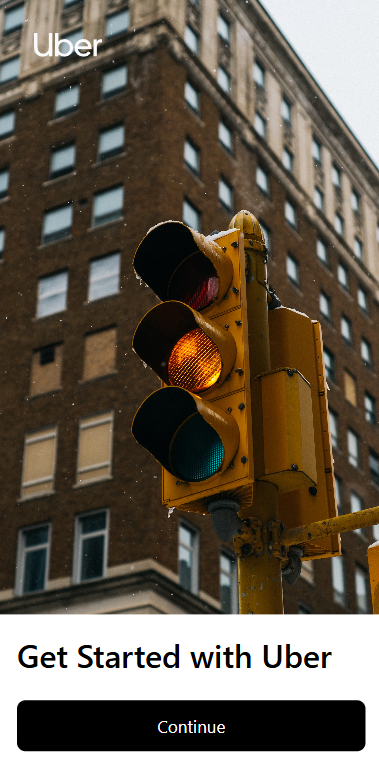
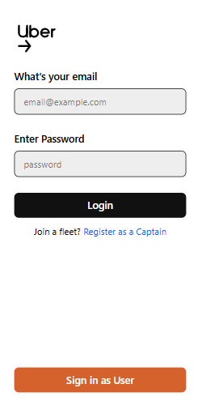
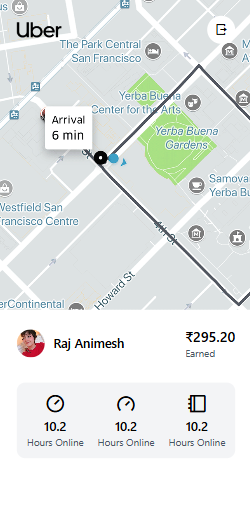

# 🚖 MERN Ride Booking Application  

A **full-fledged Uber-like ride booking application** built with the **MERN stack**, featuring **real-time ride updates with Socket.IO** and **Google Maps integration** for location search and live tracking.  

---

## ✨ Features  

- 👤 **User & Captain Authentication** (JWT-based login/signup/logout).  
- 🚗 **Ride Booking System** with live ride status (Looking, Waiting, Riding, Finished).  
- 🗺️ **Google Maps API Integration** for location search, suggestions, and live tracking.  
- 🔄 **Real-Time Communication** between user and captain using **Socket.IO**.  
- 🛡️ **Protected Routes** for both users and captains.  
- 📱 Modern **React frontend** styled with Tailwind CSS.  
- 🌐 **REST APIs** with Express.js backend & MongoDB as database.  

---

## 🛠️ Tech Stack  

**Frontend**  
- React 19  
- Vite  
- Tailwind CSS  
- Socket.IO Client  
- @react-google-maps/api  

**Backend**  
- Node.js + Express.js  
- MongoDB + Mongoose  
- Socket.IO  
- JWT Authentication  
- Axios  

---

## 📂 Project Structure  

### Backend (`/Backend`)
```
controllers/     → Handles request/response logic
db/              → Database connection (MongoDB)
middlewares/     → Authentication middleware
models/          → Mongoose schemas for User, Captain, Ride
routes/          → API routes (User, Captain, Ride, Maps)
services/        → Business logic & third-party integrations
socket.js        → Socket.IO setup
app.js           → Express app config
server.js        → Entry point (runs server)
.env             → Environment variables
```

### Frontend (`/frontend`)
```
components/      → Reusable UI components
context/         → React Contexts (User, Captain, Socket)
pages/           → Pages for Users & Captains
App.jsx          → Routing setup
main.jsx         → Entry point
.env             → Frontend environment variables
```

---

## ⚙️ Installation & Setup  

### 1. Clone the Repository  
```sh
git clone https://github.com/Sarg3n7/ride-booking-app.git
cd ride-booking-app
```

### 2. Install Dependencies  

#### Backend  
```sh
cd Backend
npm install
```

#### Frontend  
```sh
cd ../frontend
npm install
```

### 3. Setup Environment Variables  

Both `Backend` and `frontend` have a `.env.example` file.  

1. Copy `.env.example` → `.env`  
   ```sh
   cp .env.example .env
   ```
2. Update your `.env` with actual values. Example:  

**Backend/.env**  
```env
PORT=5000
MONGO_URI=for example : mongodb://0.0.0.0/uber-clone
JWT_SECRET=your_secret_key
GOOGLE_MAPS_API_KEY=your_google_maps_api_key
```

**frontend/.env**  
```env
VITE_BACKEND_URL=http://localhost:4000
VITE_GOOGLE_MAPS_API_KEY=your_google_maps_api_key
```

---

## 🌍 How to Generate Google Maps API Key  

1. Go to [Google Cloud Console](https://console.cloud.google.com/).  
2. Create a new project (or select an existing one).  
3. Navigate to **APIs & Services → Credentials**.  
4. Click **Create Credentials → API Key**.  
5. Copy the generated key and paste it into your `.env` files.  
6. Enable the following APIs:  
   - **Maps JavaScript API**  
   - **Places API**  
   - **Geocoding API**  

⚠️ Ensure that billing is enabled on your Google Cloud account.  

---

## 🚦 Running the Application  

### Start Backend  
```sh
cd Backend
npx nodemon
```

### Start Frontend  
```sh
cd frontend
npm run dev
```

Open the frontend in your browser → `http://localhost:5173` (default Vite port). Go to console and change the dimensions to a mobile screen.

---

## 🔄 Workflow of Routes & Services  

### 🧑 User Flow  
- **Signup/Login** → `user.routes.js` → `user.controller.js` → `user.service.js`  
- **Book Ride** → `ride.routes.js` → `ride.controller.js` → `ride.service.js`  
- **Get Suggestions** → `maps.routes.js` → `map.controller.js` → `maps.service.js`  

### 🚖 Captain Flow  
- **Signup/Login** → `captain.routes.js` → `captain.controller.js` → `captain.service.js`  
- **Accept Ride** → `ride.routes.js` → `ride.controller.js` → `ride.service.js`  

### 🌍 Maps Service  
- Autocomplete & Place Details → `maps.service.js` (Google Maps API)  

### 🔌 Socket.IO Flow  
- **socket.js** manages real-time ride updates.  
- Used in **UserContext** and **CaptainContext** to emit/listen to ride events.  

---

## 📸 Screenshots 
### 🏠 Home Page


### 🚗 Captain SignIn


### 📍 Captain Live Tracking

---

## 🤝 Contributing  

1. Fork the repo  
2. Create your feature branch (`git checkout -b feature/foo`)  
3. Commit changes (`git commit -m 'Add foo'`)  
4. Push to branch (`git push origin feature/foo`)  
5. Create a Pull Request  

---

## 📜 License  
MIT License © 2025 Sarg3n7
